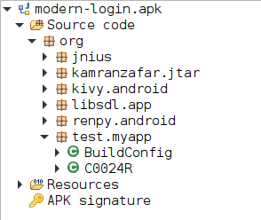
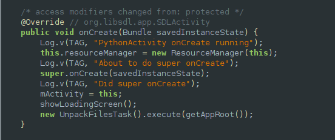
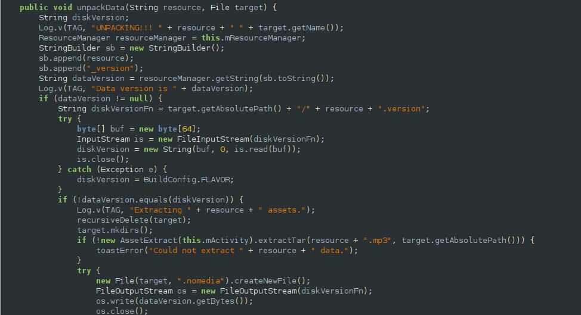

## DefCamp CTF: modern-login [android | rev]

#### This was a pretty interesting challenge which I enjoyed solving during the ctf. First thing I did was to decompile the apk with jadx-gui and noticed that it wasn't the typical java-made apk but rather it was built using kivy + renpy. 



## finding the entry point
#### As it didn't have a MainActivity file, I looked for the kivy documentation and read about details on where the entry point should be. This [document](https://buildmedia.readthedocs.org/media/pdf/kivy/master/kivy.pdf) was useful to have a glimpse of a kivy application's lifecycle. 

#### I then proceeded to install the apk into a physical device and monitor the logs upon start up. From the log results, we can see the entry point that the application takes (which is `org.kivy.android.PythonActivity` and we can begin to reverse the source starting from that point. 


## python activity


#### On the oncreate method, we can see that it calls the oncreate method of SDLActivity which the class inherits from. Afterwhich it executes the UnpackFilesTask's doInBackground method which calls `PythonActivityUtil().unpackData("private", app_root_file)`



#### The gist of this method is that it unpacks a tar file which is named as private.mp3. Using apktool to retrieve the app assets, we can see that the private.mp3 is present and using the file utility on it recognizes it as gzip compressed data.

## unpacking

#### We can unpack private.mp3 using `tar -xvf` and we are presented with some python files needed by the apk. What interests us is main.py which performs some decryption operation on obfuscated strings.
```python
from kivymd.app import MDApp
S=len
o=bytes
v=enumerate
W=print
h=None

from kivy.lang import Builder
from kivy.properties import ObjectProperty
import bcrypt
K=bcrypt.checkpw

def n(byt):
 q=b'viafrancetes'
 f=S(q)
 return o(c^q[i%f]for i,c in v(byt))

def d(s):
 y=n(s.encode())
 return y.decode("utf-8")

kv=d("|:\x02\x14\x17\x04\x00YoTESV\x00\x0f9\x11\r\x0f\x10\x16NE\x07\x13\x11\x15lRANC(0)\x12\x14\x0c\r\\xANCETESV\x1d\x04\x1e\x06[ND(\x1b\x01\x16\x04\x07A*\x1d\x06\x07\rB~ESVIAFRA\x08\x0c\x0b\x00:\x00\x02\x10\r\x03HAI+WSoSVIAFRAN\x13\n\x07:\x1b\x1f\x07\x15\\R\x1aI\x00\x00\x1a\x11\x16\x046\x19AHA^MRXET\x15\x0c\x0f\x12\x17\x131\x1aBNECXQ\x1clRANC(01\x16\x0e\x1d'\x0f\x17\r\nYoTESVIAFR\x08\nYE\x00\x00\x0b\x02cAFRANCET\r\x1a\x18\x1d>\x12\x17\x19\x1aYES \x1d\x02\x0c\x13F\x0b\x0e\x1bC\x15\x15\x16\x00\x01\x06\x13\x02UkNCETESVI\t\x03\x1e\x11\x0b\x11:\x00\x00\x0b\x02SAA4\x0e\x1c\x04\n\x00E\n\x19\x1c\x13F\x02\x00\x1d\x10\x12\x1b\x17\x17INkFRANCETE\x1b\x13\x05\x11\x03\x00>\x1a\x06\x1d\x00:\x1e\x19\r\x04\\RC\x01\r:\x12\n\x10\x03\x1aCFxANCETESV\x19\x0e\x15-\t\x07\r\x11NE\x08Q\n\x04\x08\x06\x04\x1c<\x1dS_SFGTJRF\r\x06\x0b\x00\x00\x01)\x10F\\RQ@W\x18~ESVIAFRA\x1d\n\x1f\x11:\x1b\x1f\x07\x159\n[N-\n\x1a\x00yVIAFRANC\x12\x1d\x01\x07\x1eSAUBQdCETESVIA\x0f\x11\x0e\x00<\x17\x1d\x02\x1b\x02SAD\x13\x02\r\x0c\x10\x1a\x11^\x05\x0c\x00\x14\x11\tLiETESVIAF\x00\x04\x1f\x16\x0c\x06\x00\x17LI5\x14\x07\x04dCETESVIAlRANC(07\x16\x15\x1d\x00\x08\x15\r\x0b%\t\x15\x111\x03\x1d\x15\t\x1c[dCETESVIA\x12\x17\x19\x1aYES6\x06\x14\x04\x08\x12UkNCETESVI\x11\t\x01>\x06\n\x0b\x00_S\rN\x02\x03\x1c\x15\x0b\x11:\x0cBIVYOS^AI\x00\x00\x1a\x11\x16\x046\x18AHA^MV\toSVIAFRAN\x0c\x0b+\x15\x01\x13\x1a\x12\\xANCETESVIAFR\x00\x1e\x13K\x15\x10\x07\x1eAHlRANCETESVIAFxANCE9!?\x17\x0b\x04\nHkNCETESVI\x15\x03\n\x15TCBSoSVIAFRAN\n\x01NE\x00\x1e\x06\x16lRANCETES\x06\x06\x129\x1a\x08\x00\x17_T\x1eT\x15\x0c\x0f\x12\x17\x131\x1bBNEBFGQJRF\r\x06\x0b\x00\x00\x01)\x10F\\RP^MW\to")

class Main(MDApp):
 in_class = ObjectProperty(None)
 def build(self):
  return Builder.load_string(kv)
 def auth(self):
  i=d('R[\x18BCSJ\x10)D+2\x01]6>(\x05\x16R<:T%\x04(X\x0e\x07O\x1aS\x065\x0f"?1\x07$\x02 \nS\x07\x1e,*\'\x1cP%\x166=\x11T3/\x1a')
  if K(self.root.in_class.text.encode('utf8'),i.encode('utf8')):
   z=self.root.ids.show
   g="\x15\x1d\x07\x1dATX\x00P\x11RJG\r\x04VJW_S\x07L\x00J\x15\x0bQV\x13WZ\x07TB\x06A\x15\x0f\x02T\x10\x04^S\x07EV@\x10\r\x07\x07GPW[QFUAG]XVK\x02\rR\x18"
   U=d(g)
   z.text=U
  else:
   z=self.root.ids.show
   z.text="Fail"
Main().run()
```

#### I decided to rewrite the decryption/deobfuscation functions into a more readable script and tried to decrypt all the strings which provided us with the flag.
```python
g="\x15\x1d\x07\x1dATX\x00P\x11RJG\r\x04VJW_S\x07L\x00J\x15\x0bQV\x13WZ\x07TB\x06A\x15\x0f\x02T\x10\x04^S\x07EV@\x10\r\x07\x07GPW[QFUAG]XVK\x02\rR\x18"

def rev_n(bs):

	flag = ''
	key = b'viafrancetes'
	key_len = len(key)

	for i, c in enumerate(bs):
		flag += chr(ord(bs[i]) ^ ord(key[i % key_len]))

	print(flag)
	
rev_n(g)
```

