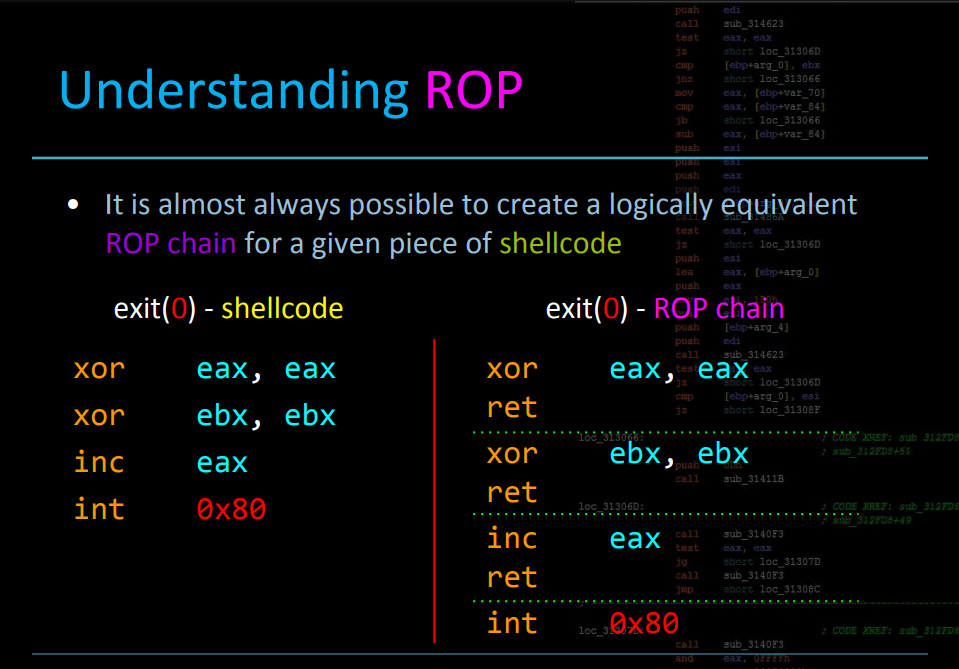

## DownUnder: Return to what's revenge [pwn]
> My friends kept making fun of me, so I hardened my program even further! The flag is located at /chal/flag.txt.

#####*tl;dr: learned how to bypass babyseccomp :)*
#### From my brief experience, revenge challenges are typically more hardened compared to their previous versions, but sometimes involve similar initial steps for exploitation. Security measures for this binary are the same as the return to what challenge, thus we can deduce that this will be another ROP challenge (but with a twist). Loading up the binary in GHIDRA, we can see new interesting functions such as the sandbox() and seccomp_bpf_label(). 

#### After a few minutes of google sessions, I found [this](https://www.kernel.org/doc/html/v4.16/userspace-api/seccomp_filter.html) link summarizing what seccomp is. From what I understood, seccomp basically is a filter for syscalls. I then continued to read some ctf writeups that involve bypassing seccomp which have helped me understand what it does better. So I installed seccomp-tools and examined the results.

#### We can see that it first checks if the architecture is x86_64 then proceeds to filter what syscalls are allowed. My initial plan was to create a rop chain to mmap a region in memory executable and place shellcode there (some writeups I read used this); the problem was that I couln't have an execve shellcode since seccomp will terminate the process as execve is not allowed. I could do a open, read, write shellcode instead (seing that they are allowed), but I thought why not just create a ROP chain for it, after all: (see below)

