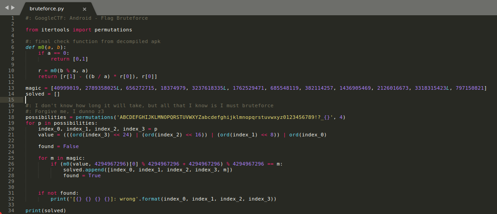
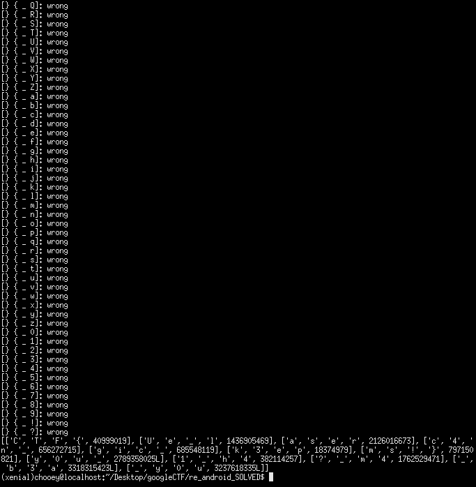

## Google CTF 2020: Android
> Can you find the correct key to unlock this app?

##### *tl;dr: a few minutes of reversing the algorithm, 1 hour & 30 mins for sore bruteforcing*

#### This challenge marked a lot of firsts for me as a CTF player: first time joining a team to compete with (OpenToAll) despite me being beginner-level at best and capturing a flag for them; first time I solved a main challenge from Google CTF (I assumed this was a non-beginner challenge since there were no beginner's quest challenges this year and this was not marked as easy in the challenge description). I had fun reversing, scripting a keygen for the challenge, and writing this writeup. For me, this is a milestone and one of the reasons for me to keep grinding, sharpening my skillset to be on par with the greatest players/teams in the world and hopefully be a decorated exploit developer in the near future.

### APK Static Analysis
#### Seeing that we were given an apk to reverse, my plan was to first decompile the apk with jadx-gui and have a peek at the source code. If there were interesting stuff that were referenced but not included in the result, I would then open the apk with apktool. The following 86 lines of code are what seems to be the MainActivity file for the application.
```java
package com.google.ctf.sandbox;

import android.app.Activity;
import android.os.Bundle;
import android.view.View;
import android.widget.Button;
import android.widget.EditText;
import android.widget.TextView;

/* renamed from: com.google.ctf.sandbox.ő  reason: contains not printable characters */
public class C0000 extends Activity {

    /* renamed from: class  reason: not valid java name */
    long[] f0class;

    /* renamed from: ő  reason: contains not printable characters */
    int f1;

    /* renamed from: ő  reason: contains not printable characters and collision with other field name */
    long[] f2;

    public C0000() {
        try {
            this.f0class = new long[]{40999019, 2789358025L, 656272715, 18374979, 3237618335L, 1762529471, 685548119, 382114257, 1436905469, 2126016673, 3318315423L, 797150821};
            this.f2 = new long[12];
            this.f1 = 0;
        } catch (I unused) {
        }
    }

    /* access modifiers changed from: protected */
    public void onCreate(Bundle savedInstanceState) {
        super.onCreate(savedInstanceState);
        setContentView(R.layout.activity_main);
        final EditText editText = (EditText) findViewById(R.id.editText);
        final TextView textView = (TextView) findViewById(R.id.textView);
        ((Button) findViewById(R.id.button)).setOnClickListener(new View.OnClickListener() {
            /* class com.google.ctf.sandbox.C0000.AnonymousClass1 */

            public void onClick(View v) {
                C0000.this.f1 = 0;
                try {
                    StringBuilder keyString = new StringBuilder();
                    for (Object chr : new Object[]{65, 112, 112, 97, 114, 101, 110, 116, 108, 121, 32, 116, 104, 105, 115, 32, 105, 115, 32, 110, 111, 116, 32, 116, 104, 101, 32, 102, 108, 97, 103, 46, 32, 87, 104, 97, 116, 39, 115, 32, 103, 111, 105, 110, 103, 32, 111, 110, 63}) {
                        keyString.append(((Character) chr).charValue());
                    }
                    if (editText.getText().toString().equals(keyString.toString())) {
                        textView.setText("🚩");
                    } else {
                        textView.setText("❌");
                    }
                } catch (J | Error | Exception unused) {
                    String flagString = editText.getText().toString();
                    if (flagString.length() != 48) {
                        textView.setText("❌");
                        return;
                    }
                    for (int i = 0; i < flagString.length() / 4; i++) {
                        C0000.this.f2[i] = (long) (flagString.charAt((i * 4) + 3) << 24);
                        long[] jArr = C0000.this.f2;
                        jArr[i] = jArr[i] | ((long) (flagString.charAt((i * 4) + 2) << 16));
                        long[] jArr2 = C0000.this.f2;
                        jArr2[i] = jArr2[i] | ((long) (flagString.charAt((i * 4) + 1) << '\b'));
                        long[] jArr3 = C0000.this.f2;
                        jArr3[i] = jArr3[i] | ((long) flagString.charAt(i * 4));
                    }
                    C0000 r6 = C0000.this;
                    if (((R.m0(C0000.this.f2[C0000.this.f1], 4294967296L)[0] % 4294967296L) + 4294967296L) % 4294967296L != C0000.this.f0class[C0000.this.f1]) {
                        textView.setText("❌");
                        return;
                    }
                    C0000.this.f1++;
                    if (C0000.this.f1 >= C0000.this.f2.length) {
                        textView.setText("🚩");
                        return;
                    }
                    throw new RuntimeException();
                }
            }
        });
    }
}
```
#### My approach was to go through the code line by line and analyze its functionality. The class initializer sets an f0class array that contains seemingly "magic" values. Then we see recognizable ascii values being loaded up into a `keyString` variable. Quickly creating a script to print out their character representations reveal that it is a fake flag: "Apparently this is not the flag. What's going on?". Nice google challenge authors, nice.

#### Scrolling further down we see that the flag we provide as input will be checked if it has 48 characters. Then it continues to go through a loop for 12 times, and perform a visually-complex looking but really simple algorithm. In summary, it loops 12 times and takes 4 characters from the flag for each iteration, then performs the algorithm `f2[i] = (((ord(flag[(i * 4) + 3]) << 24) | (ord(flag[(i * 4) + 2]) << 16)) | (ord(flag[(i * 4) + 1]) << 8)) | ord(flag[(i * 4)])`. After the values are calculated and stored, they undergo a final check with a method `m0` and some arithmetic operations then compare it with the magic values on the class initializer. Analyzing the last bits of the source code, I saw what seemed to be a counter variable which gets incremented and checked if it was greater than or equal to the flag length in order to confirm that our input is indeed the flag. Since the last part seemed to be incomplete, I made an educated guess that the last part is once again a loop that checks every calculated value and magic value, then increments the counter if they are equal. Looking through the R file given by jadx, we see that the method m0 is a recursive one and returns an array.
```java
    /* renamed from: ő  reason: contains not printable characters */
    public static long[] m0(long a, long b) {
        if (a == 0) {
            return new long[]{0, 1};
        }
        long[] r = m0(b % a, a);
        return new long[]{r[1] - ((b / a) * r[0]), r[0]};
    }
```
#### I didn't really analyze what it does aside from the fact that it is recursive, but I what I did know was that I was gonna be able to use it for solving the challenge.

### Bruteforce ideas
#### I reimplemented the core algorithms for the challenge in python, and did quick tests with the first part of the flag. I assumed that the first four characters of the flag would be 'CTF{' as it is the flag format, provided it as input for the algorithm to process and confirmed that it passed the final check. Given that we know already know a part of the flag, we only need the remaining 44 characters. Although the magic values are given, it is not easy to simply retrieve the characters needed to pass the checks, leaving me no other choice but to bruteforce the possible combinations. The plan seemed simple, but I needed to think intelligently about it, as generating permutations from the range of printable ascii characters would take the bruteforce script a lot of time to loop and check. Instead I opted to only generate permutations from the most common characters to be used in flags for ctfs; it would still take quite some time to run but will be significantly faster compared to the former idea. Behold, the bruteforce script I am proud of despite being painfully time consuming:


#### Fast forward to almost 2 excruciating hours later, we finally have the characters that passed all the checks!. It was now smooth sailing from this point, as all that was needed to do was arrange the characters in the order of their respective magic values(40999019 first, followed by 2789358025L, so on and so forth). And just like that I captured my first flag for one of the top teams: `CTF{y0u_c4n_k3ep_y0u?_m4gic_1_h4Ue_laser_b3ams!}`


## Conclusion
#### As I stated in the introduction, I had a fun time solving the challenge and waiting for the script to do its purpose. It was a satisfying solve, despite taking hours to complete. Maybe I could've done better using z3 or other tools, I dunno it's only now that I've heard of these. Well, that's another thing to learn and and improve with.
