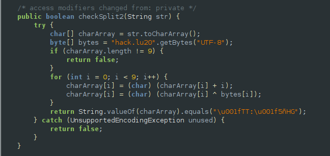
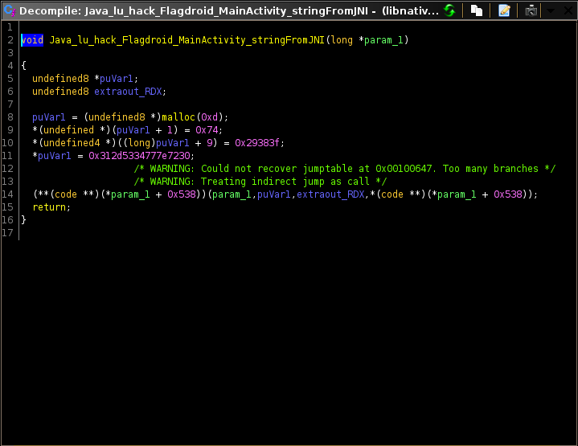

## Hack.Lu CTF: flagdroid [rev]


#### Though this was among the easiest challenges in the ctf, I still had fun solving it since it was the first time I got to work with reversing an android native library. The ctf was very hard, but I managed to solve two challenges and placed 184th.


## Challenge synopsis
#### I opened the apk using jadx-gui and examined the source code of the MainActivity class. It was a 'bomb'-like challenge, since you needed to pass different phases of it in order to get the flag. The code splits the user input into 4 parts then runs a unique method for each of these parts.

## Phase 1


#### Phase 1 is pretty straightforward, we can simply examine the string resources of the apk then base64 decode the value of encoded.

```python
#: check 1
print(base64.b64decode('dEg0VA=='))
#: tH4T (phase 1/4)
```

## Phase 2


#### Again, the algorithm is easy to understand. Since we know that xor is a reversible process and we have the hardcoded key and ciphertext, we can simply reciprocate the algorithm to get the plaintext.

```python
key = [x for x in 'hack.lu20']

for i in range(9):
	key[i] = ord(key[i]) ^ ord(bytestr[i])
	key[i] = key[i] - i

print(''.join([chr(x) for x in key]))
#: w45N-T~so (phase 2/4)
```

## Phase 3


#### What we can see here is that the third part of the flag will be in lowercase and the first four characters are 'h4rd'. We just need to bruteforce the last 4 characters and make sure that the concatenated string matches the md5 hash.

```python
goal = ''
check3 = 'h4rd'
alphabet = '_!@#$%^&*()+~fghijklmnopqrstuvwxyzabcde1234567890-={}[]|\\/?.>,<'
found = False
for i in alphabet:
	for i2 in alphabet:
		for i3 in alphabet:
			for i4 in alphabet:

				target = '6d90ca30c5de200fe9f671abb2dd704e'
				test= check3 + i + i2 + i3 + i4
				md5 = hashlib.md5()
				md5.update(test)
				print(test)
				print(md5.hexdigest())
				

				if md5.hexdigest() == target:
					goal = test
					print(test)
					found = True
					break

				if found: 
					print('FOUND')
					print(goal)

#: h4rd~huh (phase 3/4)
```

## Phase 4


#### This is the most interesting part of the challenge. It just checks whether the last part of the flag is equal to the result of the stringFromJNI method. This method comes from the native-lib.so which was loaded at the start of the code.


#### What I did next was to extract the apk using apktool, find the library in the lib directory, then disassemble the shared object file using GHIDRA.


#### Here, a string is simply loaded into memory (it was easily recognizable after some reversing experience). We just need to arrage it then decode from hex in order to get the last part.

```python
jnistr = 0x29383f74312d5334777e7230
print(hex(jnistr)[2:-1].decode('hex')[::-1])

#: 0r~w4S-1t?8) (phase 4/4)
```

#### Since we have all parts of the flag now, we just simply concatenate them using underscores as seperators then wrap them into the flag format.
#### Flag: `flag{tH4T_w45N-T~so_h4rd~huh_0r~w4S-1t?8)}`