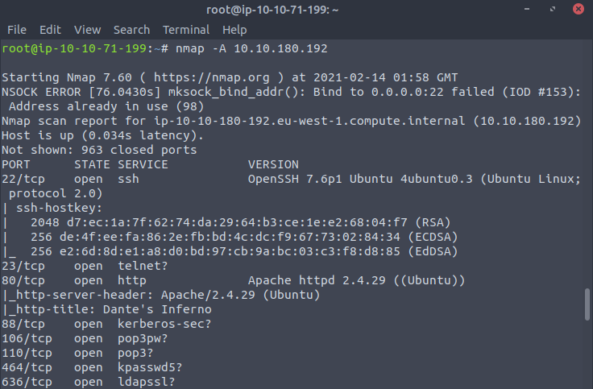
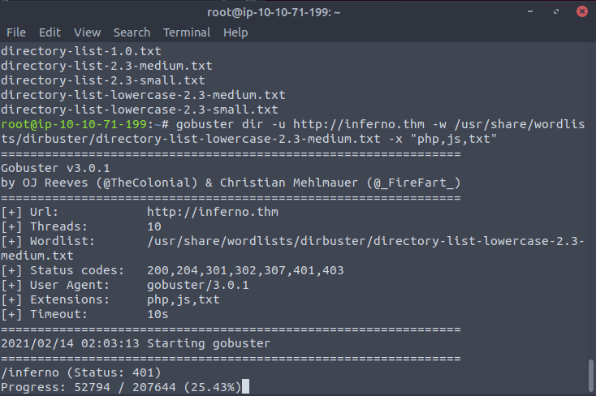
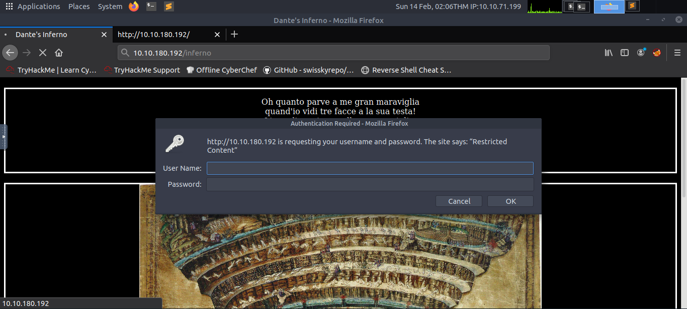
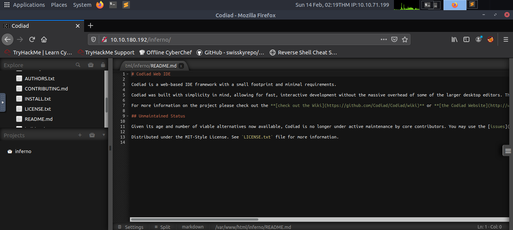
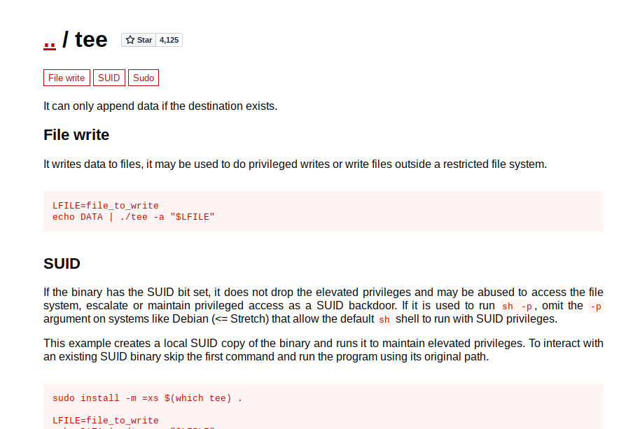

## INFERNO [tryhackme]

> "Midway upon the journey of our life I found myself within a forest dark, For the straightforward pathway had been lost. Ah me! how hard a thing it is to say What was this forest savage, rough, and stern, Which in the very thought renews the fear."
> There are 2 hash keys located on the machine (user - local.txt and root - proof.txt), can you find them and become root?


## Background Info
#### This marks the first medium-level box I did on [tryhackme](https://tryhackme.com/) and the first writeup I'll do aside from the usual jeopardy pwn challs. I'll start documenting my solves on future boxes as a way to prepare for OSCP documentation if I'll ever have the chance to take it. Inferno was a pretty fun box for me, I suggest taking a shot at it. 

## Enumeration
#### First off, we start with a simple nmap scan. I usually do `nmap -sC -sV -oN nmap_res <IP>`, but since it didn't return anything for me on the initial try I decided to do an aggressive scan instead. It was able to scan numerous open ports but what we only have to work with are the ssh and http ports.


#### We don't have ssh credentials just yet, so we perform recon on the http part. We are greeted with a simple webpage with seems to contain a few lines from Canto 34 of Dante's *Inferno* (note to self: might need to get a copy of this) and an image of Dante's interpretation of hell. After checking the page source, I did a gobuster scan to reveal the /inferno page.


#### Navigating to this page requires passing a basic http auth prompt. 


#### Since I didn't know how to approach these, I researched some techniques regarding bruteforcing basic auths using hydra and found [this](http://tylerrockwell.github.io/defeating-basic-auth-with-hydra/). I luckily guessed that the username was admin, but the proper way to approach this was to create a wordlist for possible user names. Waiting for the hydra attack to finish grants us the password to proceed.

```
[80][http-get] host: inferno.thm login: admin password: [REDACTED]
1 of 1 target successfully completed, 1 valid password found
```

#### We then are directed to a login page for Codiad where we can use the same creds to login. It turns out that Codiad is a web-based IDE. Using searchsploit, we find two exploits for the IDE but none have worked. I then researched again and was able to find an [exploit script for remote code execution](https://github.com/WangYihang/Codiad-Remote-Code-Execute-Exploit).


#### I got stuck for quite some time since I couldn't get the exploit to work despite following the instructions. After some debugging, I found out that it doesn't pass the http auth that's why it fails. The solution was to add the following line of code to the login function:

```python
session.auth = ("admin", "[REDACTED]")
```

## Initial shell 
#### Running the exploit provides us with a shell but with a user that has no priviledge (can't read the local.txt flag) so we need to find a way to elevate our priviledges. I spent some time going through different directories until I found a suspicious `.download.dat` file in the Downloads directory that is riddled with hex characters. Decoding the hex contents using cyberchef presents some lines of some canto from Inferno and what seems to be ssh credentials:

```
[...]
Tu se’ lo mio maestro e ’l mio autore,
tu se’ solo colui da cu’ io tolsi
lo bello stilo che m’ha fatto onore.

Vedi la bestia per cu’ io mi volsi;
aiutami da lei, famoso saggio,
ch’ella mi fa tremar le vene e i polsi».

dante:[REDACTED]
```

#### We can now successfully login into ssh and retrieve the first flag for the box.

## Privesc
#### Before using enumeration scripts, I first check if there are commands which we can run as root.


#### We can run tee with sudo priveledges on the machine. Checking the gtfobins entry for the tee binary, we can see that we have the ability to perform arbitrary writes with root privs on any file. 


#### Cool, so what next. I had no idea and got stuck again. My initial thought process was that maybe there was a cronjob that maybe we can write a reverse shell script to and wait for the time to hit; but there was none and the ssh seemed to die for some reason after quite some time so that attack path wasn't feasible. 

#### After some time of research again, I stumbled upon the idea of adding a user with root permissions from [this](https://d00mfist1.gitbooks.io/ctf/content/privilege_escalation_-_linux.html) resource. With tee running as root, we can forge a new user and add an entry into /etc/passwd. We can then proceed to su as the forged user and we will have a root shell!